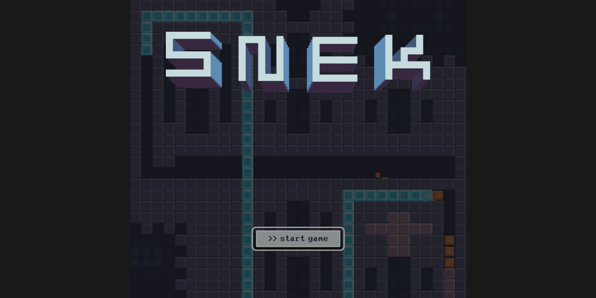

<h1 align="center">
  <strong>Hi there, I'm Don 👾</strong>
</h1>

<!--
**townofdon/townofdon** is a ✨ _special_ ✨ repository because its `README.md` (this file) appears on your GitHub profile.
-->

<!--
Available themes here: https://github.com/anuraghazra/github-readme-stats/blob/master/themes/README.md#stats
-->

  
  
  
  

Programmer by day, musician by night.

Fighter of the night man.

Coder of the universe.

 

<h2 align="center">
  Featured Projects 💻
</h2>

<!--
PROJECTS AUTO-GENERATED
EDIT: config.yml
RUN: npm run build
-->

  <!-- BEGIN_REPOS -->
  
  
  
  
  
  
  
  
  
  
  
  
  
  <!-- END_REPOS -->

 

<h2 align="center">
  About Me 🤓
</h2>

Timezone: EST/EDT

I'm a full-time senior software engineer currently working for Airship LLC. I specialize in highly-modular and intuitive UIs built with React Native and React.

- 📹 I’m currently working on [YouTube Javascript tutorials](https://www.youtube.com/channel/UC0s6jJw80V6-qG9KkUVjXfA)
- 📦 I’m currently learning Unity && Blender
- 🤙 I’m looking to collaborate on game dev
- ⚡ Fun fact: I released 6 solo piano albums and 1 electronic EP in 2020 - it almost killed me 💀

 

<h2 align="center">
Tools & Technologies
</h2>

<!--
TOOLS AUTO-GENERATED
EDIT: config.yml
RUN: npm run build
-->

  <!-- BEGIN_TOOLS -->
  
  
  
  
  
  
  
  
  
  
  
  
  
  
  <!-- END_TOOLS -->

 

---

  

  

